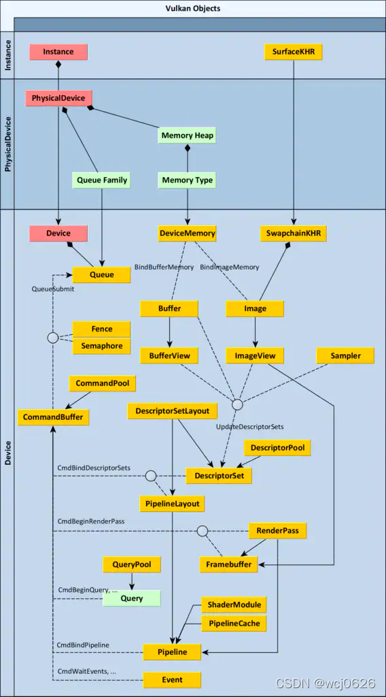

基本的代码结构
```
class HelloTriangleApplication {
public:
    void run() {
        initWindow();
        initVulkan();
        mainLoop();
        cleanup();
    }
}
int main() {
    HelloTriangleApplication app;
    try {
        app.run();
    }
    catch (const std::exception& e) {
        std::cerr << e.what() << std::endl;
        return EXIT_FAILURE;
    }

    return EXIT_SUCCESS;
}
```
类成员

```
GLFWwindow* window;

VkInstance instance;
VkDebugUtilsMessengerEXT debugMessenger;
VkSurfaceKHR surface;

VkPhysicalDevice physicalDevice = VK_NULL_HANDLE;
VkDevice device;

VkQueue graphicsQueue;
VkQueue presentQueue;

VkSwapchainKHR swapChain;
std::vector<VkImage> swapChainImages;
VkFormat swapChainImageFormat;
VkExtent2D swapChainExtent;
std::vector<VkImageView> swapChainImageViews;
std::vector<VkFramebuffer> swapChainFramebuffers;

VkRenderPass renderPass;
VkPipelineLayout pipelineLayout;
VkPipeline graphicsPipeline;

VkCommandPool commandPool;
VkCommandBuffer commandBuffer;

VkSemaphore imageAvailableSemaphore;
VkSemaphore renderFinishedSemaphore;
VkFence inFlightFence;
```
这里介绍所有的概念，包括但不限于类成员，按照一定的依赖关系来描述
* window
  * GLFW提供的窗体
* instance
  * vulkan实例
* physicalDevice
  * 物理设备，也就是显卡
  * 通过instance获取到，一个实例可以使用多个物理设备
* device
  * 逻辑设备，通过physicalDevice的信息创建，同一物理设备可以创建多个逻辑设备
* surface
  * 是vulkan与窗口系统交互的接口，比如保存着glfw创建的窗口的句柄。所以他是通过instance和window创建
  * 他需要保证物理设备支持Surface的扩展。
  * 最后我们通过下面的presentQueue来进行vulkan和窗口的交互
* swapChain
  * 交换链，类似于opengl中的默认帧缓冲，我们将图片画在缓冲区，通过交换链把这个图片显示到显示屏上
  * 需要物理设备支持交换链拓展
  * 需要检查物理设备和surface是否兼容，主要包括下面三个，都是依赖physicalDevice和surface来查询
    * Swap extent（交换链中图像的最小/最大数量、图像的最小/最大宽度和高度）
    * Surface format（像素格式、色彩空间）
    * Presentation mode
      * VK_PRESENT_MODE_IMMEDIATE_KHR 立即模式 可能会导致撕裂。
      * VK_PRESENT_MODE_FIFO_KHR 先进先出 如果队列已满，则程序必须等待 次推荐
      * VK_PRESENT_MODE_FIFO_RELAXED_KHR  如果申请迟到并且队列在最后一个垂直空白处为空，则此模式与前一种模式不同。图像最终到达时会立即传输，而不是等待下一个垂直空白。这可能会导致可见的撕裂
      * VK_PRESENT_MODE_MAILBOX_KHR  这是第二种模式的另一种变体。当队列已满时，不会阻塞应用程序，而是将已排队的图像简单地替换为较新的图像。此模式可用于尽可能快地渲染帧，同时仍避免撕裂，从而比标准垂直同步减少延迟问题。这通常称为“三重缓冲”，尽管仅存在三个缓冲区并不一定意味着帧速率已解锁 推荐
  * 还依赖下面的queueFamilies
* queueFamilies
  * 队列族，通过physicalDevice获取。vulkan的每个操作（这里应该指cpu对显示器和cpu对gpu的操作）都是通过队列提交命令，而不同类型的队列可以提交的命令类型都不一样，我们从物理设备中得到queueFamilies，再从中挑选适合的queue的下标存起来
  * graphicsQueue
    * 用来提交渲染指令
  * presentQueue
    * 用来提交呈现指令，就是将交换链中的图像发送给显示器
* swapChainImages
  * 类型是VkImage，但是叫交换链图像，由交换链生成，前面Swap extent已经指定了他的数量。交换链销毁的时候会自己销毁。
* swapChainImageViews
  * 交换链图像视图，描述如何访问图像和要访问图像的哪一部分，例如是否应将其视为没有任何 mipmap 级别的 2D 纹理深度纹理。
  * 可以将它们用作颜色目标。
  * 如果开发立体 3D 应用程序，那么创建一个具有多个层的交换链。然后，您可以通过访问不同的图层为每个图像创建多个图像视图，代表左眼和右眼的视图。默认的就建一层就行了。
* swapChainImageFormat
  * 上面交换链下面的Surface format中的像素格式
* swapChainExtent
  * 上面交换链下面的Swap extent
*  SPIR-V
   *  着色器字节码格式，使用glslc编译器编译而成。
* graphicsPipeline
  * 图形管线，他包含以下几个方面，有些方面可编程，有些方面需要配置，每个都需要严格指定，共同构成图形管线
  * input assembler
    * 可配置，指定缓冲区收集顶点数据
  * vertext shader
    * 可编程，顶点着色器，顶点位置从模型空间转换到屏幕空间
  * tessellation
    * 可编程，曲面细分着色器，允许您根据某些规则细分几何体以提高网格质量。
  * geometry shader
    * 可编程，几何着色器，在每个图元（三角形、线、点）上运行，并且可以丢弃它或输出比输入更多的图元。
  * rasterization
    * 可配置，光栅化。将基元离散成片段。顶点着色器输出的属性会在片段之间进行插值。由于深度测试，其他原始片段后面的片段也会在这里被丢弃。
    * multisampling
      * 多重采样，执行抗锯齿的方法之一，也在图形管线阶段配置。
  * fragment shader
    * 可编程，片段着色器
  * color blending
    * 可配置，颜色混合映射到帧缓冲区中相同像素的不同片段。片段可以简单地相互覆盖、累加或基于透明度混合。
  * other set
    * 这里不属于一次渲染管线的范围了，但是是属于管线的配置
    * pipelineLayout
      * 指定着色器中使用 uniform 值，这些值是类似于动态状态变量的全局变量
    * viewports and scissors
      * 指定了视口和裁剪区域的大小，可以使用dynamicState方便后面使用命令对其修改
* renderpass
  * 一个renderpass就是一次完整的渲染效果
  * 一个renderpass包含了多次subpass,每个subpass就是走完了一遍图形管线。
  * 创建完了renderpass之后，需要为他指定framebuffer作为渲染目标。framebuffer由多个附件构成，一个附件就是一张图，subpass渲染后将结果放入附件，所以创建subpass时，需要设置对应的附件格式和附件下标。
  * 其中附件就是上面生成的swapChainImageViews
  * dependency记录subpass之间的依赖关系。vulkan从性能出发会尽量让subpass并行运行，而如果存在一个subpass需要上一个subpass输出的纹理作为输入的情况，则需要使用dependency规定它们的同步规则。
* commandBuffer
  * 命令缓冲，这里可以理解为是vulkan的性能优化，我们已经有了queue可以提交命令，但是渲染循环中，cpu准备数据、gpu渲染、io是并行的，要让vulkan发挥他的并行的优点，就可以开辟一段内存放入命令，通过一些同步原语来控制命令的提交。
  * Semaphore
    * 信号量，一种同步原语，其实就是一个标志位。我们把命令先提交到buffer，当标志位成立时，buffer就向queue提交命令。
    * vkQueueSubmit不会阻塞cpu，内部实现上应该是以回调的方式让buffer向queue发送命令。
    * 在本例中，我们使用他做两个事情
      * 当图片读取完了，再向gpu提交渲染命令。
      * 当gpu渲染完了，再呈现给显示器
  * Fences
    * 围栏，另一种同步原语，他会阻塞cpu的进行。
    * 本例中Fance是为了实现“一帧渲染完了再渲染另一帧”的效果才使用他，实际上他会减慢cpu收集数据的速度。
    * 为了避免他的减慢，我们可以使用Flighting Frame飞行帧来处理，就是创建多个commandBuffer和多套同步变量，每次drawFrame时交替渲染。
  * commandPool
    * 命令池，通过graphicsQueue对应的queueFamily下标创建，作用是开辟一段内存。
* debugMessenger
  * 通过实例创建，用来传递debug信息


```
    void initVulkan() {
        createInstance(); // 1.创建实例
        setupDebugMessenger(); // 2.为实例设置调试回调
        createSurface(); // 3.通过glfw创建surface
        pickPhysicalDevice(); // 4.通过实例查找并选择物理设备
        createLogicalDevice(); // 5.通过物理设备创建逻辑设备
        createSwapChain(); // 6.创建交换链和Image
        createImageViews(); // 7.通过Image创建ImageView
        createRenderPass(); // 8.创建renderpass，创建他们的subpass和subpass之间的依赖关系dependency
        createGraphicsPipeline(); // 9.创建图形管线，包括里面的着色器,输入,视口,混合，多重采样等功能
        createFramebuffers(); // 10.通过ImageView创建帧缓冲
        createCommandPool(); // 11.创建命令池，开辟空间
        createCommandBuffer(); // 12.通过命令池创建命令缓冲
        createSyncObjects(); // 13.创造同步原语
    }
```
在opengl中，默认帮我们创建了交换链，Image，ImageView和FrameBuffer来作为一个默认帧缓冲。我们只需要执行Draw函数再glfwSwapBuffers(window)即可实现渲染。

在vulkan中,我们不会假定渲染出来的图片是需要显示到屏幕中，所以交换链可有可无

但是为什么需要从交换链创建Image，再从Image创建到ImageView，再从ImageView创建出来FrameBuffer？可以从以下图片得到答案


FrameBuffer可以看作是一次pass的输出结果，而Descripter这条路线可以认为是pass的输入。

在上图中，Buffer和Image是同级别的东西，他们都是设备的一段内存资源，Buffer表示的是一段二进制数据；Image则表示图像，包含了布局（layout）、格式(format)和mip等信息。

Buffer和Image不直接用于渲染，需要多加一层view，用来指定颜色通道、裁剪范围、mip层级等信息。ImageView不仅可以作为输出，也可作为渲染的输入。

由上图也可以看出，当我们不需要渲染到屏幕的时候，也可以开辟一段内存，作为FrameBuffer的最终指向。

回过头看createSwapChain，我们来看创建交换链时做了些什么。
    1. 首先我们综合屏幕和显卡的支持，选择了最优的屏幕大小和色彩显示和图片格式等信息
    2. 根据物理设备的支持，选择presentMode和创建的Image数量
    3. 指定输出的附件类型，是颜色附件还是一个单纯的图片以用来后处理
    4. 指定每个图像组成的层数之类的设置。
    5. 创建交换链后，他为我们开辟了一段内存空间来存放Image，他们组成了一个链

drawFrame做了什么
    1. 等待上一帧完成
    2. 从交换链获取图像
    3. 记录一个命令缓冲区，将场景绘制到该图像上
    4. 提交记录的命令缓冲区
    5. 展示交换链图像
其中使用的同步原语来控制时序，上面解释挺清楚了，但还有一部分没解释
    Semaphores分为wait和signal。wait就是这个操作要等信号被signal了才能执行。并且这个同步并没有规定阻塞在什么阶段，所以对于graphic_queue，需要指定他pWaitDstStageMask
当窗口变化，如窗口大小变换的时候，就需要重建交换链，连同他产生的ImageView和FrameBuffer都要一起重建，详见recreateSwapChain。需要注意的是，当前正在用的资源不能销毁，需要等vkDeviceWaitIdle(device)结束后再重建。如果最小化的话，w和h会为0，此时让他处于循环中就可以了

createRenderPass做了什么
* 设置附件列表，当前只有一个，且是颜色附件
  * format 同交换链图像的格式一样
  * samples 多重采样相关
  * loadOp  渲染之前如何处理附件中的数据
    * VK_ATTACHMENT_LOAD_OP_LOAD ：保留附件的现有内容
    * VK_ATTACHMENT_LOAD_OP_CLEAR ：在开始时将值清除为常量
    * VK_ATTACHMENT_LOAD_OP_DONT_CARE ：现有内容未定义；我们不关心他们
  * storeOp 渲染之后如何处理附件中的数据
    * VK_ATTACHMENT_STORE_OP_STORE ：渲染的内容将存储在内存中，稍后可以读取
    * VK_ATTACHMENT_STORE_OP_DONT_CARE ：渲染操作后帧缓冲区的内容将是未定义的
  * stencilLoadOp stencilStoreOp 适用于模板数据 所以设置为dont care
  * initialLayout finalLayout
    * Vulkan 中的纹理和帧缓冲区由具有特定像素格式的 VkImage 对象表示，但是内存中像素的布局可能会根据您尝试对图像执行的操作而改变
    * VK_IMAGE_LAYOUT_COLOR_ATTACHMENT_OPTIMAL ：用作颜色附件的图像
    * VK_IMAGE_LAYOUT_PRESENT_SRC_KHR ：要在交换链中呈现的图像
    * VK_IMAGE_LAYOUT_TRANSFER_DST_OPTIMAL ：用作内存复制操作目标的图像
* 设置颜色附件引用
  * 一个附件引用包含多个附件，具体是哪几个用下标来指定
* 设置subpass， 一个subpass对应着多种附件引用
  * colorAttachmentCount指的是附件数量，而colorAttachmentRef.attachment指的是着色器中引用的`layout(location = 0) out vec4 outColor`
  * 除了当前引用的pColorAttachments,子通道也可以引用下面其他类型的附件
    * pInputAttachments ：从着色器读取的附件
    * pResolveAttachments ：用于多重采样颜色附件的附件
    * pDepthStencilAttachment ：深度和模板数据的附件
    * pPreserveAttachments ：此子通道不使用但必须保留数据的附件
    * 这些引用的类型都是VkAttachmentReference
* 设置dependence
  * 上面说过，这是用来指定subpass的执行依赖性的，除此之外还可以让他自动控制图像的布局转换
  * 我们现在只有一个子通道，但该子通道之前和之后的操作也算作隐式“子通道”
  * 一个subpass由多个阶段（stage）构成，即便其中一些具有资源依赖关系，其他阶段仍然可以充分并行以提高性能，dependency属性作用大致可以总结为：对于src pass，srcStageMask标记的阶段完成前，dst subpass中dstStageMask标记的阶段都需要等待。stageMask关注阶段，而accessMask则是关注读写行为。
  * 阶段在VkPipelineStageFlagBits中分了30多个阶段
  * 举个例子srcStageMask=阶段A dstStageMask=阶段B，则src和dst的subpass可以在GPU并行，只是dst的阶段B会阻塞直到src的阶段A完成。
  * 在本例中，srcSubpass是子通道之前的通道，dstPass就自身，当前渲染在执行到VK_PIPELINE_STAGE_COLOR_ATTACHMENT_OUTPUT_BIT阶段时阻塞，这个阶段必须要用到交换链中的Image了，直到waitSemaphores信号量改变（图片加载完毕）时，dependenc认为依赖有了，就继续执行
  * 所以，srcAccessMask设置为0，不关心初始的状态
  * 再说布局
    * colorAttachment中我们定义了initialLayout和finalLayout,意思是附件开始的布局和结束的布局，结束的布局是VK_IMAGE_LAYOUT_PRESENT_SRC_KHR，这是最终给显示器的布局
    * colorAttachmentRef中也定义了布局，表示的是这个subpass需要的布局
    * 也就是说，附件布局会从VK_IMAGE_LAYOUT_UNDEFINED到VK_IMAGE_LAYOUT_COLOR_ATTACHMENT_OPTIMAL再到VK_IMAGE_LAYOUT_PRESENT_SRC_KHR
    * 自动布局转换发生在srcStage阶段的srcAccess操作结束之后，此时image的内存才对B可见。这是由dependency指定的，如果没有指定dependency，会给一个默认的，此时布局的转换在一开始就会进行，此时图片还在读取，数据就损坏了
    * 

